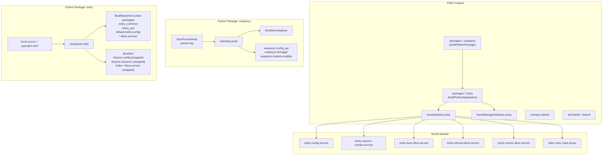
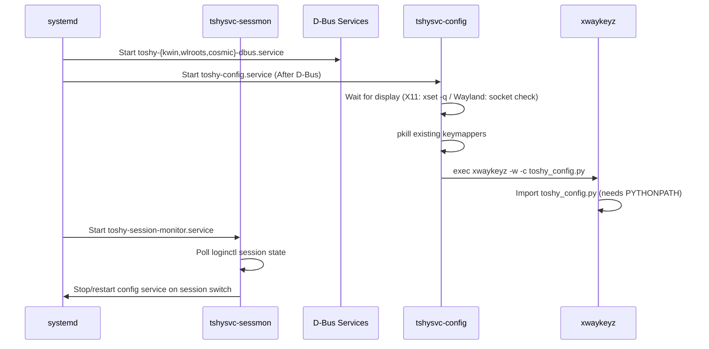
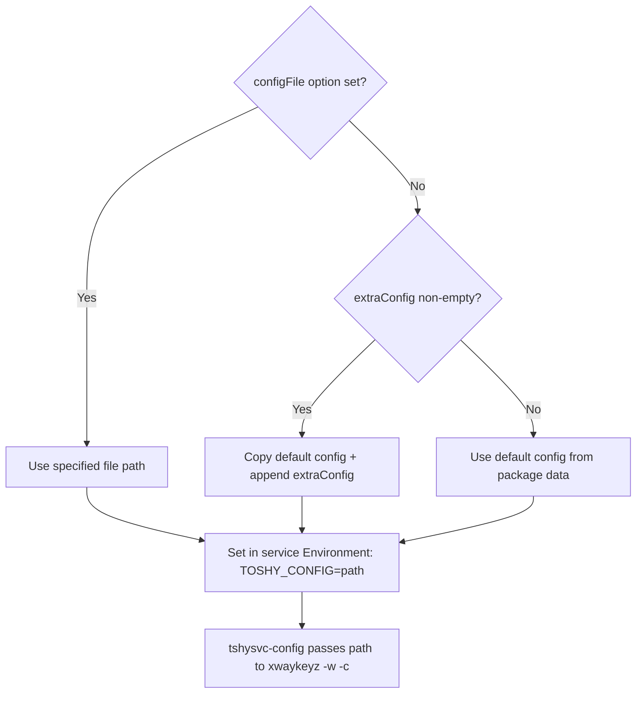
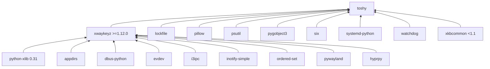

# Design Document: toshy-nix-flake

## Overview

This design describes the official Nix flake for Toshy, a Mac-style keybinding application for Linux. The flake packages Toshy and its dependency xwaykeyz as proper Nix Python packages, provides NixOS and Home Manager modules for systemd user service management, and creates a `pyproject.toml` suitable for upstream contribution to RedBearAK/toshy.

The core challenge is replacing Toshy's venv-based runtime model with Nix store paths. Upstream's architecture relies on shell scripts that `source .venv/bin/activate` before invoking Python. In Nix, we instead wrap scripts with `makeWrapper` to set `PATH` and `PYTHONPATH`, and use `buildPythonApplication` to produce properly-linked binaries.

### Key Design Decisions

1. **pyproject.toml for upstream**: Uses setuptools, declares `toshy_common` and `toshy_gui` as packages, includes D-Bus service directories as package-data. Designed to work both for `pip install` and `buildPythonApplication`.

2. **No wrapper package**: Unlike the existing port's `toshy/` wrapper package (daemon.py, tray.py, etc.), the new design uses upstream's actual scripts directly. Entry points in pyproject.toml point to the real upstream modules.

3. **Shell script replacement**: The upstream shell scripts that activate venvs are replaced with Nix-wrapped versions that set `PATH` to include the Nix store's `xwaykeyz`, `pkill`, `loginctl`, etc.

4. **Minimal NixOS module**: No keymap generation from Nix, no compositor force-enabling, no hardcoded UIDs. Just the five systemd user services with correct ordering and environment.

5. **Python overlay for version pinning**: A Python package overlay that overrides `python-xlib` to 0.31 and `xkbcommon` to <1.1, propagating through the entire dependency graph.

6. **Update resilience**: The flake is designed to survive upstream updates by the maintainer with minimal or zero changes to the Nix packaging. See the dedicated section below.

### Update Resilience Strategy

The flake must survive upstream updates by RedBearAK without requiring a Nix packaging rework every release. This is achieved through several design principles:

#### Principle 1: Lean on upstream's own structure, don't reinvent it

The `pyproject.toml` declares packages using `setuptools.packages.find` with broad includes (`toshy_common*`, `toshy_gui*`) rather than enumerating every submodule. If the maintainer adds `toshy_common/new_module.py` or `toshy_gui/gui/new_panel.py`, they're automatically picked up — no Nix changes needed.

Similarly, `package-data` uses glob patterns (`scripts/**/*`, `assets/**/*`) so new scripts, icons, or config files are included without touching the packaging.

#### Principle 2: The NixOS module references binaries, not internals

The module's service definitions reference `${pkg}/bin/tshysvc-config`, `${pkg}/bin/tshysvc-sessmon`, etc. — the same script names the upstream maintainer already uses. If the maintainer changes the internal logic of `tshysvc-config` (e.g., adds a new environment check), the Nix wrapper still works because it only prepends to `PATH` and `PYTHONPATH` — it doesn't replace the script.

If the maintainer renames a script or adds a new service, that's a deliberate architectural change that would require a corresponding Nix module update — but that's expected and appropriate.

#### Principle 3: Version pinning is isolated and documented

The Python overlay for `python-xlib==0.31` and `xkbcommon<1.1` is in a separate `nix/python-overlay.nix` file with comments explaining *why* each pin exists and linking to the upstream issues. When the upstream bugs are fixed and the maintainer unpins these in `requirements.txt`, the Nix overlay can be removed in one place without touching anything else.

#### Principle 4: xwaykeyz is pinned to a tag, not `main`

The existing port fetches xwaykeyz from `main` branch — meaning any push could break the build. The new design pins to a release tag (e.g., `v1.12.0`). Updating xwaykeyz is a deliberate action: bump the tag and hash in `nix/xwaykeyz.nix`. This is the standard Nix pattern and makes updates predictable.

#### Principle 5: The pyproject.toml is designed for upstream adoption

If the maintainer accepts the `pyproject.toml` PR, they own it going forward. They can add new entry points, update dependencies, or restructure packages — and `buildPythonApplication` will pick up those changes automatically on the next `nix flake update`. The Nix flake only needs to change when:
- A new *system-level* dependency is added (new native library in `buildInputs`)
- A new *service* is added (new systemd unit in the NixOS module)
- A dependency version pin changes (update `nix/python-overlay.nix`)

Normal code changes, config file updates, new keymaps, new Python modules within existing packages — all handled automatically.

#### What requires a Nix packaging update

| Upstream Change | Nix Impact | Effort |
|----------------|------------|--------|
| New Python module in `toshy_common/` | None (glob pattern picks it up) | Zero |
| New file in `scripts/bin/` | None (glob pattern picks it up) | Zero |
| Updated `toshy_config.py` | None (installed as package-data) | Zero |
| New Python dependency in `requirements.txt` | Add to `propagatedBuildInputs` | 1 line |
| New native/system dependency | Add to `buildInputs` | 1 line |
| New systemd service | Add service to NixOS module | ~10 lines |
| Renamed script (e.g., `tshysvc-config` → `tshysvc-cfg`) | Update module ExecStart + wrapper | ~5 lines |
| New top-level Python module (e.g., `toshy_new_tool.py`) | Add to `py-modules` in pyproject.toml | 1 line |
| xwaykeyz version bump | Update tag + hash in `nix/xwaykeyz.nix` | 2 lines |
| python-xlib pin removed upstream | Remove override from `nix/python-overlay.nix` | Delete ~5 lines |

## Architecture



### Runtime Flow



## Components and Interfaces

### 1. xwaykeyz Package (`packages.<system>.xwaykeyz`)

**Type**: `buildPythonPackage` with `format = "pyproject"`

**Source**: `fetchFromGitHub` pinned to a release tag (e.g., `v1.12.0` or latest stable)

**Build system**: hatchling

**Propagated dependencies** (from nixpkgs where available):
- `appdirs`
- `dbus-python`
- `evdev`
- `i3ipc`
- `inotify-simple`
- `ordered-set`
- `pywayland`
- `python-xlib` (overridden to 0.31)
- `hyprpy` (custom build from PyPI)

**Output**: `$out/bin/xwaykeyz` binary + importable `xwaykeyz` Python package

### 2. Toshy Package (`packages.<system>.toshy`)

**Type**: `buildPythonApplication` with `format = "pyproject"`

**Source**: Local flake source (`./.`) with the new `pyproject.toml`

**Build system**: setuptools

**Packages declared in pyproject.toml**:
- `toshy_common` — shared utilities
- `toshy_gui` — GTK4 preferences app
- `toshy_gui.core`, `toshy_gui.gui`, `toshy_gui.resources` — GUI subpackages

**Package-data** (non-Python files installed alongside):
- `default-toshy-config/` — the 5700-line config + barebones config
- `kwin-dbus-service/` — KWin D-Bus service script + org.toshy.Toshy.service
- `wlroots-dbus-service/` — wlroots D-Bus service script + protocols/
- `cosmic-dbus-service/` — COSMIC D-Bus service script + protocols/
- `scripts/` — shell scripts (tshysvc-config, tshysvc-sessmon, bin/*)
- `assets/` — icons and icon theme
- `desktop/` — .desktop files
- `kwin-script/` — KWin scripts
- `systemd-user-service-units/` — reference service files

**Console script entry points** (in pyproject.toml):
- `toshy-tray` → `toshy_tray:main` (top-level module)
- `toshy-gui` → `toshy_gui.__main__:main`
- `toshy-layout-selector` → `toshy_layout_selector:main` (top-level module)

**Additional wrapped scripts** (installed via `installPhase`):
- `$out/bin/tshysvc-config` — wrapped shell script with PATH including xwaykeyz, pkill, xhost, xset
- `$out/bin/tshysvc-sessmon` — wrapped shell script with PATH including loginctl, systemctl, pkill
- `$out/bin/toshy-kwin-dbus-service` — wrapper that invokes `toshy_kwin_dbus_service.py` with correct PYTHONPATH
- `$out/bin/toshy-wlroots-dbus-service` — wrapper that invokes `toshy_wlroots_dbus_service.py` with correct PYTHONPATH
- `$out/bin/toshy-cosmic-dbus-service` — wrapper that invokes `toshy_cosmic_dbus_service.py` with correct PYTHONPATH

**Wrapping strategy**:
- `wrapGAppsHook` for GTK3/GTK4 typelibs and schemas (GUI scripts)
- `makeWrapper` for shell scripts to prepend runtime tools to PATH
- D-Bus service wrappers set `PYTHONPATH` to include the toshy package's site-packages (for `toshy_common`, protocol modules, and `xwaykeyz`)

**Native build inputs**: `setuptools`, `wheel`, `wrapGAppsHook`, `gobject-introspection`

**Build inputs** (native libraries): `gtk3`, `gtk4`, `gobject-introspection`, `libappindicator-gtk3`, `libayatana-appindicator`, `libnotify`, `libadwaita`, `gsettings-desktop-schemas`

**Propagated build inputs**: All Python runtime deps + `xwaykeyz`

### 3. Python Overlay for Version Pinning

A Python package set overlay that:
1. Overrides `python-xlib` to version 0.31 (fetched from PyPI with correct hash)
2. Overrides `xkbcommon` to a version <1.1
3. Adds `hyprpy` as a new package (built from PyPI source)

This overlay is applied to the Python package set used by both `xwaykeyz` and `toshy`, ensuring version consistency across the entire dependency graph without `catchConflicts = false`.

```nix
pythonOverlay = final: prev: {
  python-xlib = prev.python-xlib.overridePythonAttrs (old: rec {
    version = "0.31";
    src = fetchPypi { pname = "python-xlib"; inherit version; hash = "..."; };
  });
  xkbcommon = prev.xkbcommon.overridePythonAttrs (old: rec {
    version = "0.8";  # Last version before 1.1 breaking changes
    src = fetchPypi { pname = "xkbcommon"; inherit version; hash = "..."; };
  });
  hyprpy = final.buildPythonPackage { ... };
};
```

### 4. NixOS Module (`nixosModules.toshy`)

**Options**:

| Option | Type | Default | Description |
|--------|------|---------|-------------|
| `services.toshy.enable` | bool | `false` | Enable Toshy services |
| `services.toshy.package` | package | `pkgs.toshy` | Toshy package to use |
| `services.toshy.user` | string | (required) | User to run Toshy as |
| `services.toshy.configFile` | path or null | `null` (uses default) | Custom toshy_config.py |
| `services.toshy.extraConfig` | lines | `""` | Python code appended to config |
| `services.toshy.gui.enable` | bool | `false` | Install GUI desktop files |
| `services.toshy.kwinScript.enable` | bool | `false` | Install KWin script |

**Services created** (all `systemd.user.services`):

1. **toshy-config.service**
   - `ExecStart` = `${pkg}/bin/tshysvc-config`
   - `WantedBy` = `default.target`
   - `After` = `default.target`
   - `Restart` = `always`, `RestartSec` = 5

2. **toshy-session-monitor.service**
   - `ExecStart` = `${pkg}/bin/tshysvc-sessmon`
   - `WantedBy` = `default.target`
   - `After` = `default.target`
   - `Restart` = `always`, `RestartSec` = 5

3. **toshy-kwin-dbus.service**
   - `ExecStart` = `${pkg}/bin/toshy-kwin-dbus-service`
   - `WantedBy` = `default.target`
   - `Restart` = `on-failure`, `RestartSec` = 5

4. **toshy-wlroots-dbus.service**
   - `ExecStart` = `${pkg}/bin/toshy-wlroots-dbus-service`
   - `WantedBy` = `default.target`
   - `Restart` = `on-failure`, `RestartSec` = 5

5. **toshy-cosmic-dbus.service**
   - `ExecStart` = `${pkg}/bin/toshy-cosmic-dbus-service`
   - `WantedBy` = `default.target`
   - `Restart` = `on-failure`, `RestartSec` = 5

**Service ordering**: D-Bus services have no explicit ordering dependency (they start independently). The config service starts `After = default.target`. The session monitor starts `After = default.target`. This matches upstream's approach where all services use `WantedBy=default.target` and the session monitor handles coordination.

**System configuration**:
- Adds user to `input` group
- Installs udev rules: `KERNEL=="event*", GROUP="input", MODE="0660"`
- Ensures `input` group exists

**What the module does NOT do**:
- No hardcoded `DISPLAY`, `WAYLAND_DISPLAY`, `XDG_RUNTIME_DIR`
- No `programs.hyprland.enable`, `services.xserver.displayManager.*.enable`
- No Python keymap code generation from Nix attributes
- No `wayland.compositor` or `x11.windowManager` options

### 5. Home Manager Module (`homeManagerModules.toshy`)

**Options**: Same as NixOS module minus `user` (implicit from Home Manager context) and minus udev rules (system-level).

**Behavior**:
- Installs Toshy package into user profile
- Creates the same five systemd user services
- Copies default `toshy_config.py` to `~/.config/toshy/toshy_config.py` via `xdg.configFile` (if no custom config specified)
- If `configFile` is set, symlinks that file instead

### 6. pyproject.toml (for upstream contribution)

**Design principles**:
- Must work with `pip install .` in a standard venv (upstream's use case)
- Must work with `buildPythonApplication` in Nix (our use case)
- Declares only packages that exist in the upstream repo structure
- Uses `setuptools.packages.find` with broad glob includes so new submodules are picked up automatically
- Does NOT create a wrapper `toshy/` package — uses the actual upstream module names
- Uses glob patterns for package-data so new files in existing directories are included without changes

**Package structure declared**:
```toml
[tool.setuptools.packages.find]
where = ["."]
include = ["toshy_common*", "toshy_gui*"]

[tool.setuptools]
py-modules = ["toshy_tray", "toshy_layout_selector"]
```

Note: `toshy_common*` matches `toshy_common`, `toshy_common.submodule`, etc. If the maintainer adds new subpackages under `toshy_common/` or `toshy_gui/`, they're automatically included.

**Entry points**:
```toml
[project.scripts]
toshy-tray = "toshy_tray:main"
toshy-gui = "toshy_gui.__main__:main"
toshy-layout-selector = "toshy_layout_selector:main"
```

**Package-data** (for non-Python files needed at runtime):
```toml
[tool.setuptools.package-data]
"*" = [
    "default-toshy-config/**/*",
    "kwin-dbus-service/**/*",
    "wlroots-dbus-service/**/*",
    "cosmic-dbus-service/**/*",
    "scripts/**/*",
    "assets/**/*",
    "desktop/**/*",
    "kwin-script/**/*",
    "systemd-user-service-units/**/*",
]
```

Note: The `**/*` glob patterns mean new files added to these directories by the maintainer (new scripts, new icons, updated service files) are automatically included without touching the pyproject.toml. Since these directories are not inside a Python package, they'll be handled via `data_files` or a custom `postInstall` phase in Nix.

### 7. Flake Structure

```
flake.nix                    # Main flake definition
flake.lock                   # Locked inputs
pyproject.toml               # For upstream contribution + Nix build
modules/toshy.nix            # NixOS module
home-manager/toshy.nix       # Home Manager module
nix/                         # Nix-specific build files
  xwaykeyz.nix              # xwaykeyz package definition
  hyprpy.nix                # hyprpy package definition
  python-overlay.nix         # Python version pinning overlay
```

## Data Models

### Configuration File Resolution



### Package Dependency Graph



### Service Environment Variables

Each wrapped script/service receives these environment variables via `makeWrapper`:

| Service | PATH additions | PYTHONPATH additions | Other |
|---------|---------------|---------------------|-------|
| tshysvc-config | xwaykeyz/bin, coreutils, procps, xorg.xhost, xorg.xset | (inherited from Python wrapper) | TERM=xterm |
| tshysvc-sessmon | coreutils, systemd, procps | — (pure shell) | TERM=xterm |
| toshy-kwin-dbus-service | procps | toshy site-packages (for toshy_common, xwaykeyz) | TERM=xterm |
| toshy-wlroots-dbus-service | procps | toshy site-packages (for toshy_common, xwaykeyz, protocols) | TERM=xterm |
| toshy-cosmic-dbus-service | procps | toshy site-packages (for toshy_common, xwaykeyz, protocols) | TERM=xterm |

### NixOS Module Option Schema

```nix
{
  services.toshy = {
    enable = mkEnableOption "Toshy keybinding service";
    package = mkPackageOption pkgs "toshy" { };
    user = mkOption { type = types.str; };
    configFile = mkOption { type = types.nullOr types.path; default = null; };
    extraConfig = mkOption { type = types.lines; default = ""; };
    gui.enable = mkOption { type = types.bool; default = false; };
    kwinScript.enable = mkOption { type = types.bool; default = false; };
  };
}
```

## Error Handling

### Build-Time Errors

| Error Condition | Detection | Response |
|----------------|-----------|----------|
| python-xlib version conflict | Nix dependency resolution (no `catchConflicts = false`) | Build fails with clear conflict message showing which packages require different versions |
| xwaykeyz source hash mismatch | `fetchFromGitHub` hash verification | Build fails with expected vs actual hash; developer updates `flake.lock` or hash |
| Missing Python dependency | Import check during `buildPythonApplication` | Build fails listing the missing module; add to `propagatedBuildInputs` |
| pyproject.toml syntax error | setuptools build phase | Build fails with setuptools error message |

### Runtime Errors

| Error Condition | Detection | Response |
|----------------|-----------|----------|
| xwaykeyz not on PATH | `tshysvc-config` checks `command -v xwaykeyz` | Script prints error and exits 1; systemd restarts after 5s |
| No display available | `tshysvc-config` X11/Wayland checks | Script loops waiting (up to 30 attempts for X11) or exits 1 |
| User not in input group | evdev device open fails | xwaykeyz prints permission error; user must be added to input group |
| toshy_config.py import failure | Python ImportError at xwaykeyz startup | xwaykeyz exits with traceback; systemd restarts |
| Session becomes inactive | `tshysvc-sessmon` detects via loginctl | Session monitor stops config service; restarts when session reactivates |
| D-Bus service fails to register | dbus.exceptions.DBusException | Service exits; systemd restarts on-failure after 5s |

### Configuration Errors

| Error Condition | Detection | Response |
|----------------|-----------|----------|
| Custom configFile doesn't exist | NixOS module assertion | `nixos-rebuild` fails with assertion message |
| extraConfig has Python syntax error | Runtime (xwaykeyz loads config) | xwaykeyz exits with Python traceback; user fixes config |
| user option not set | NixOS module assertion | `nixos-rebuild` fails: "services.toshy.user must be specified" |

## Testing Strategy

### Why Property-Based Testing Does Not Apply

This feature is primarily **Nix packaging and infrastructure configuration**:
- Package definitions are declarative (not functions with varying inputs)
- NixOS modules are declarative configuration generators
- Shell script wrappers are fixed transformations (not parameterized logic)
- The "correctness" of this system is verified by: does it build? do services start? can scripts find their dependencies?

PBT is not appropriate because:
1. There are no pure functions with meaningful input variation
2. The outputs are Nix store paths and systemd unit files — deterministic for a given input
3. Testing requires integration with the Nix build system, not randomized inputs

### Testing Approach

#### 1. Build Tests (Smoke)

- `nix build .#toshy` succeeds without `catchConflicts = false` or `dontCheckRuntimeDeps = true`
- `nix build .#xwaykeyz` succeeds
- `nix flake check` passes on both x86_64-linux and aarch64-linux
- Built package contains expected binaries: `$out/bin/xwaykeyz`, `$out/bin/tshysvc-config`, `$out/bin/tshysvc-sessmon`, `$out/bin/toshy-kwin-dbus-service`, `$out/bin/toshy-wlroots-dbus-service`, `$out/bin/toshy-cosmic-dbus-service`

#### 2. Import Tests (Unit/Integration)

- Python can `import xwaykeyz.config_api` from the built package
- Python can `import toshy_common.env_context` from the built package
- Python can `import xwaykeyz.lib.logger` from the built package
- The default `toshy_config.py` can be loaded by xwaykeyz without import errors (requires PYTHONPATH to include toshy's data directory)

#### 3. Wrapper Tests (Integration)

- `tshysvc-config` wrapper has `xwaykeyz` on PATH (verify with `grep` on wrapper script)
- `tshysvc-sessmon` wrapper has `loginctl`, `systemctl` on PATH
- D-Bus service wrappers have correct PYTHONPATH entries
- GUI wrappers have GI_TYPELIB_PATH set for GTK3/GTK4

#### 4. Module Evaluation Tests (Unit)

- NixOS module evaluates without errors when `services.toshy.enable = true` and `services.toshy.user = "test"`
- Module produces exactly 5 systemd user services
- Services use `WantedBy = ["default.target"]`
- No hardcoded DISPLAY, WAYLAND_DISPLAY, or XDG_RUNTIME_DIR in service environments
- Module adds user to input group
- Module installs udev rules

#### 5. NixOS VM Integration Tests (Optional)

- Boot a NixOS VM with the module enabled
- Verify services are created in `~/.config/systemd/user/`
- Verify `systemctl --user status toshy-config` shows the correct ExecStart path
- Verify the user is in the `input` group

#### 6. Desktop File Tests

- `.desktop` files are installed to `$out/share/applications/`
- Icons are installed to `$out/share/icons/`
- Desktop file `Exec=` lines reference Nix store paths

### Test Implementation

Tests will be implemented as:
1. **Nix `passthru.tests`** on the package derivation for build/import verification
2. **`nix flake check`** for module evaluation tests
3. **CI workflow** (GitHub Actions with Nix) for cross-architecture builds
4. **Optional NixOS test** (`nixos/tests/`) for full VM integration testing
